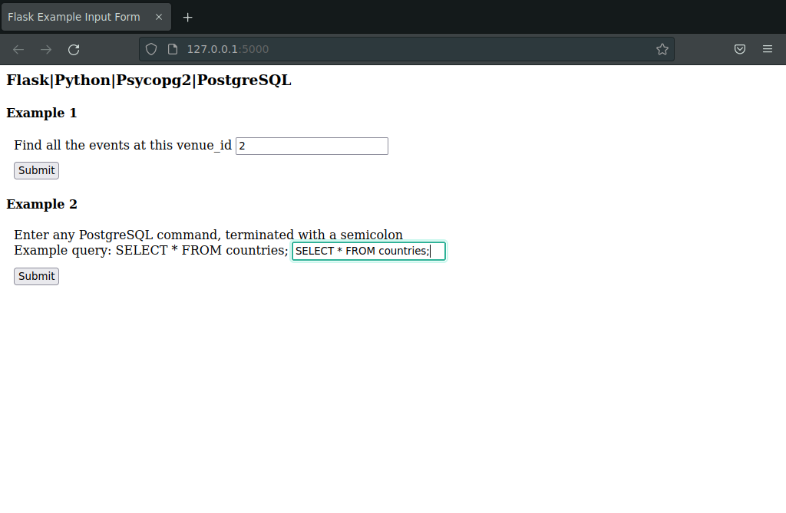
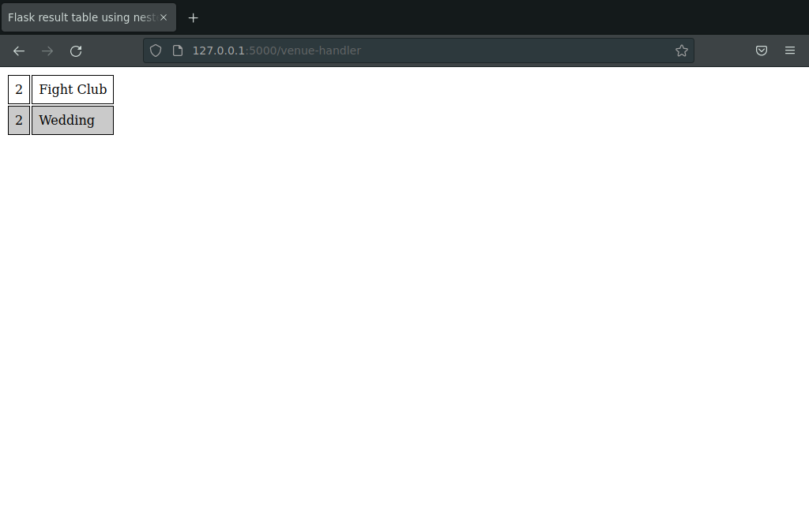
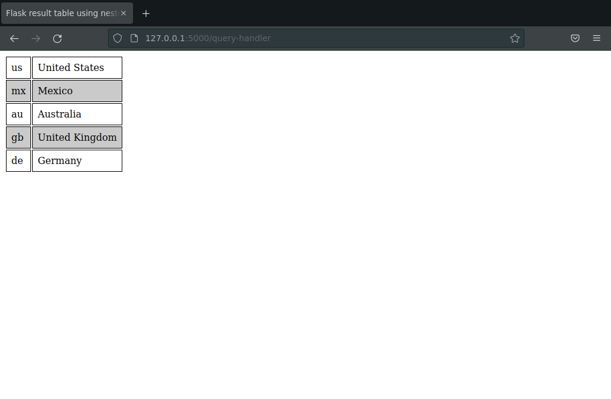

# flask7dbs

## Overview

This is an example Flask | Python | Psycopg2 | PostgreSQL
application that connects to the 7dbs database from
Chapter 2 of _Seven Databases in Seven Weeks Second Edition_
by Luc Perkins with Eric Redmond and Jim R. Wilson.
The CSC 315 VM is assumed.

## One-Time Installation

You must perform this one-time installation in the CSC 315 VM:

```
# install python pip and psycopg2 packages
sudo pacman -Syu
sudo pacman -S python-pip python-psycopg2

# install flask
pip install flask
```

## Usage

To run the Flask application, simply execute:

```
export FLASK_APP=app.py
flask run
# then browse to http://127.0.0.1:5000/
```

## Screenshots
  
  
  

## References

Flask documentation:  
https://flask.palletsprojects.com/  

Psycopg2 documentation:  
https://www.psycopg.org/  

This example code is derived from:  
https://www.postgresqltutorial.com/postgresql-python/  
https://scoutapm.com/blog/python-flask-tutorial-getting-started-with-flask  
https://www.geeksforgeeks.org/python-using-for-loop-in-flask/  
